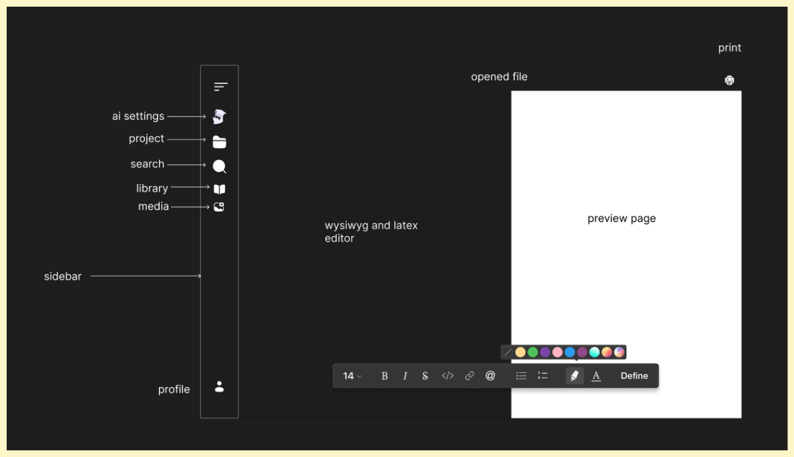

#

 

## Thesis wizard

### Problem

1. If given the option students and some researchers  will let the AI do all the work for them.
2. Teachers want to know whether students are just using AI do all the work in order to give a fair grade.
3. It is almost impossible to know if a student is using AI by just looking at the final product. the best you can do is get a probability of the student using AI. **This is not fair**

### Solution

Integrating Ai into the word processor and tracking AI usage to provide full disclosiure of Ai usage.

### Current design

### TODO

- [x] Initial design setup
- [ ] Markdown, latex wysiwyg editor
- [ ] Preview pane
- [ ] PDF Text Preprocessing and LLM Knowledge Base Construction
  - [ ] Document Parsing
  - [ ] Text Chunking
- [ ] Information retrival and citation
  - [ ] RAG
  - [ ] Paraphrasing
  - [ ] Citation and refrence generation
    - [ ] IEEE citation
    - [ ] APA citation
- [ ] AI configuration
  - [ ] Custom Model selection
  - [ ] model fine tuning
- [ ] AI usage tracking
- [ ] AI usage disclosure
- [ ] Word count goals
- [ ] User settings
- [ ] Export to PDF
- [ ] Community plugins support
  - [ ] Community discord

### Future work

- [ ] Video Knowledge Base
- [ ] Zotero integration
- [ ] Internet search for model
